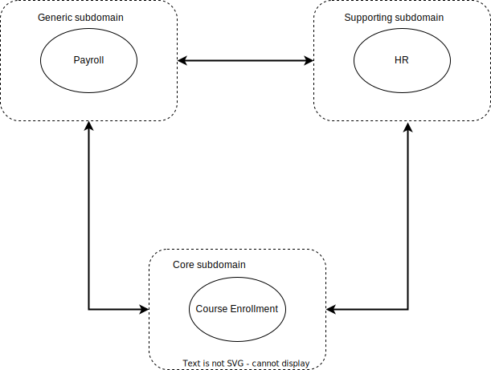
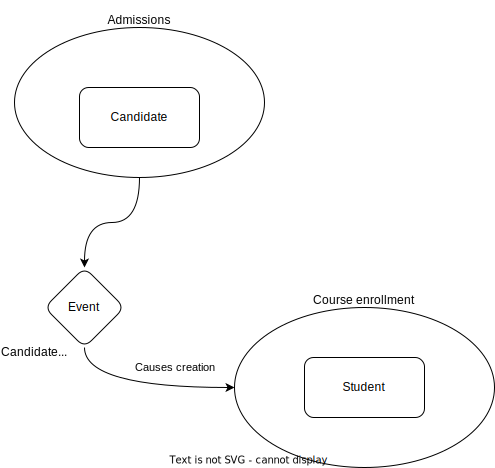

# Domain Driven Design

Domain-driven design (DDD) is a major software design approach,[1] focusing on modeling software to match a domain according to input from that domain's experts.

## Table of Contents

- [Domain Driven Design](#domain-driven-design)
  - [Table of Contents](#table-of-contents)
  - [Key concepts](#key-concepts)
    - [1. Ubiquitous Language](#1-ubiquitous-language)
    - [2. Bounded Context](#2-bounded-context)
    - [3. Entities](#3-entities)
    - [4. Value Objects](#4-value-objects)
    - [5. Aggregates and Aggregate Roots](#5-aggregates-and-aggregate-roots)
    - [6. Repositories](#6-repositories)
    - [7. Domain Services](#7-domain-services)
    - [8. Domain Events](#8-domain-events)
    - [9. Context Mapping](#9-context-mapping)
    - [10. Modules (a.k.a. Subdomains within a Context)](#10-modules-aka-subdomains-within-a-context)
    - [11. Strategic Design (Core, Supporting, and Generic Subdomains)](#11-strategic-design-core-supporting-and-generic-subdomains)
    - [12. Anti-Corruption Layer (ACL)](#12-anti-corruption-layer-acl)
    - [13. Factories](#13-factories)
    - [14. Application Services (vs. Domain Services)](#14-application-services-vs-domain-services)
  - [Implementation](#implementation)
    - [Strategic Design](#strategic-design)
    - [Tactial Design](#tactial-design)
- [Example (Strategic design)](#example-strategic-design)
  - [Subdomains](#subdomains)
    - [Generic Subdomain](#generic-subdomain)
    - [Supporting Subdomain](#supporting-subdomain)
    - [Core Domain](#core-domain)
    - [Bounded Context](#bounded-context)
    - [Context mapping](#context-mapping)
      - [Types of Context Mapping](#types-of-context-mapping)
    - [Domain Events](#domain-events)

## Key concepts

### 1. Ubiquitous Language

- **Definition**: A shared language that both domain experts and developers use to describe the domain, ensuring clear and unambiguous communication.
- **Purpose**: Fosters collaboration, reduces misunderstandings, and helps keep the software model aligned with real business requirements.

### 2. Bounded Context

- **Definition**: A boundary within which a particular domain model is defined and applicable. It encapsulates the model and ensures clarity on how terms and concepts are used in that context.
- **Purpose**: Prevents ambiguity by keeping models “small” and focused. Within each bounded context, terms in the ubiquitous language have specific meanings.

### 3. Entities

- **Definition**: Objects that have a unique identity that runs through time and different states.
- **Characteristics**: Tracked by identity rather than by attributes.May change their attributes, but the identity remains the same.
- **Example:** A “Customer” in an e-commerce system; even if a customer changes their email address, they are still the same entity.

### 4. Value Objects

- **Definition**: Objects that are defined by their attributes rather than by identity. They are immutable and have no conceptual identity.
- **Characteristics**:
  Immutable (changes create new instances).
  Equality is based on the values of attributes, not an ID.
  **Example**: An “Address” or “Money” object; if one value changes, you create a new instance rather than mutate the existing one.

### 5. Aggregates and Aggregate Roots

- **Definition**: An aggregate is a cluster of entities and value objects that is treated as a single unit for data changes. The aggregate root is the entity that externally references the entire aggregate.

  **Purpose**:
  Enforces invariants and consistency rules within the boundary of the aggregate.
  Ensures that changes do not break the consistency of the objects inside.
  Example: An “Order” aggregate might include the Order entity (as the root), and its line items as child entities. The Order entity is responsible for maintaining consistency.

### 6. Repositories

- **Definition**: Mechanisms for retrieving and storing aggregates. They simulate a collection-like interface that the domain layer can use without knowing the underlying data storage details.

**Purpose**:

- Encapsulate data access logic.
- Provide methods to add, remove, and retrieve aggregates.

### 7. Domain Services

- **Definition**: Operations that don’t conceptually belong to any individual entity or value object but still contain domain logic.
- **Characteristics**:
  Are stateless in nature (although they may operate on entities).
  Implement behaviors or calculations that span multiple entities or value objects.
  Example: A service that calculates currency exchange rates and updates relevant value objects.

### 8. Domain Events

- **Definition**: Events that signify something meaningful within the domain has occurred.

**Purpose**:
Promotes a decoupled design by allowing different parts of the system to react to changes without direct coupling.
Informs other bounded contexts or subsystems of domain changes.

### 9. Context Mapping

- **Definition**: A technique to analyze and clarify relationships between different bounded contexts and how they integrate (e.g., Customer Context, Billing Context).
  Common Patterns:
  - Shared Kernel
  - Customer-Supplier
  - Conformist
  - Anti-Corruption Layer

### 10. Modules (a.k.a. Subdomains within a Context)

- **Definition**: Logical groupings of domain concepts and artifacts within a bounded context.

**Purpose**: Enhance clarity and maintainability by organizing code according to natural conceptual clusters.

### 11. Strategic Design (Core, Supporting, and Generic Subdomains)

- **Core Subdomain**: The central part of the business that differentiates the organization from its competitors.
- **Supporting Subdomain**: A subdomain that is not the core but necessary to support the core (often delegated or simplified).
- **Generic Subdomain**: Generic solutions that can be used across multiple domains (e.g., identity management, payment gateways).

### 12. Anti-Corruption Layer (ACL)

- **Definition**: A boundary layer that translates or isolates your domain model from another legacy or external system to prevent “corruption” of the internal model.

**Purpose**: - Ensures the integrity of your domain’s ubiquitous language. - Translates external data to your domain model and vice versa.

### 13. Factories

- **Definition**: Encapsulate the logic required to create complex aggregates or entities, often ensuring they’re created in a valid state.

**Purpose**: Keep the creation logic out of the entities themselves, maintaining a cleaner domain model.

### 14. Application Services (vs. Domain Services)

- **Definition**: Services that sit at the edge of the domain layer, orchestrating application flow and directing domain objects to perform business operations.

**Purpose**:

- Coordinate tasks and transactions.
- Communicate with infrastructure (repositories, message buses, external services).
- Delegate business rules to domain entities, value objects, or domain services.

## Implementation

To implement Domain driven design (DDD), you'll need to the discover the (sub)domains that make up your business.

The approach can generaly be divided into 2 main steps:

1. Strategic Design
2. Tactical Design

### Strategic Design

DDD Strategic Design patterns belong to the Problem Space. In this space, we focus on performing high-level analysis of the domain and its constraints, staying away from technical details. It's not about writing a code or thinking of any specific tech stack, or architecture. It is to discover the domains

Strategic Design in DDD is a set of principles and practices focused on:

1. Identifying and defining the business Core Domains and Subdomains.
2. Establishing clear boundaries between different parts of the system (Bounded Contexts).
3. Developing a shared language (Ubiquitous Language) within each Bounded Context.
4. Mapping relationships between different Bounded Contexts and Teams (Context Mapping).
5. Aligning the software architecture with the business strategy and domain structure.

### Tactial Design

DDD Tactical Design patterns are used to gradually transition towards the Solution space. We will also be getting closer to the code of the software system.

Bounded Context is the main vehicle between the spaces. For now, all you need to know is that Bounded Context is just a model. This model is created as a part of the problem space, and further developed into a software system fitting into the solution space.

# Example (Strategic design)

Elixir University

Every academic year students run through the university course offer — didactic, language, physical education etc. Course catalog is made available to the students days before the actual enrollment starts. This gives the students time to prepare their personal enrollment plan. Once the enrollment officially starts, everyone runs to sign up for selected classes before all the others do.

The university is developing a system to support that. A designated university staff task force organizes the student enrollment — it is the Course Enrollment Team.

## Subdomains

A Subdomain represents a specific area of knowledge and functionality within the larger system. It has the following characteristics:

- clear business goal: breaks down the legacy domain model that is too large to work with, into logical parts that have a clear business objective,
- clear area of expertise: can indicate a specific team of domain experts / organizational department that owns the subdomain,
- strategic importance: contributes to the business bringing different strategic value.

### Generic Subdomain

The university does not have to develop separate software for each of such subdomains. For example, Payroll management is not anything particularly specific to the university business. It is a rather typical subdomain for any institution dealing with employees. Solutions for such domains can often be purchased “off the shelf” — cheaper and with more quality than developed in-house. Such domains in DDD are called Generic Subdomains since they require generic solutions for their problems.

### Supporting Subdomain

Not everything can be achieved with generic products, though. Some subdomains may require solutions with different degrees of customization. When a new employee is onboarding at the Elixir University, they receive a laptop, a desk, and access cards to the campus. They also need to pass the basic safety course. Managing different aspects of onboarding may call for an ERP system which is tailored to specific processes implemented at the university. Systems like ERP are incredibly complex. Customization usually takes time and external consultant to implement it.

An area which is strategic for the organization where custom development is needed, but development can be outsourced — is called Supporting Subdomain.

A supporting subdomain is important strategically for the business but does not account for what we would call “core activity”. The HR is vital for the university, but in order to have employees to deal with, in the first place the business needs to have a competitive offering that enables the company to hire and then manage their staff.

### Core Domain

Typically, a business or system has only one Core Domain. This core domain represents the primary area of strategic importance and competitive advantage for the organization. It's where the organization should focus most of its resources and innovation efforts.

It may be a situation where no “off the shelf” product exists, or it’s hard to customize. Most probably, it is the core product of your business that differentiates you from the competitors. This domain is your business!

### Bounded Context

A Bounded Context brings together and isolates concepts that serve a unique business goal. In the ideal DDD world we only work with Bounded Contexts and interactions between them (in a form of Context Mappings). However, when dealing with Legacy Systems, we cannot be assured that their domain models are built with isolation and modularization in mind. Subdomains are used to group and partition the legacy domain models into organizational units. The objective is to achieve a similar functional structure of the Bounded Context when pure DDD is applied. Most of the time, a single Bounded Context would correspond to a single Subdomain.

If we developed a system from scratch using solely a DDD approach, we would have only Bounded Contexts in our view (i.e. HR Bounded Context, Payroll Bounded Context etc.). A Subdomain is a conceptual bridge between existing variety of domain models from legacy system and new Bounded Contexts developed already with DDD.

### Context mapping

In Domain-Driven Design, Context Mapping helps teams understand how different parts of the system relate to and communicate with each other. It also clarifies the boundaries and interactions between different domains or subdomains.

DDD makes team collaboration a first-class citizen.
Teams need to interact with each other to share vital information that helps them achieve their business goals.

In Elixir University, the information about a Candidate joining the college is passed from the Admission Team to the Course Enrollment Team, so the new student can sign up for classes.
The notion of Candidate in admissions has to be translated to the notion of Student in course enrollment.

Both teams cooperate to make this information sharing smooth and make some agreements (like Admission model that includes Candidate should not change in the future without a notice as it will impact enrollment operations etc.).

#### Types of Context Mapping

There are a couple of integrations approaches between the Bounded Contexts. I will not cover them here in much detail to not mud the waters in this introductory article. Remember that Context Mappings is about types of collaboration between the teams related to the data flow:

- **Partnership**: two teams integrate their software systems closely, treating them as one combined system and sharing the model code across team boundaries. This mapping style is suitable when the teams have a trustful relationship and a substantial overlap in their domain models.
- **Shared Kernel**: involves multiple teams sharing a subset of the domain model, which is treated as a shared kernel, while each team maintains its own context and model for the rest of their respective domains.
- **Customer-Supplier**: one team (the supplier) develops a software system that is consumed by another team (the customer), with a clear upstream-downstream relationship between the two teams.
- Conformist: one team (the conformist) adheres to a model defined by another team, essentially treating the other team’s model as the central, canonical model.
- **Anticorruption Layer**: involves creating a translation layer between two different models, allowing them to communicate without tightly coupling or requiring changes to their respective models.
- **Open Host Service**: one team (the host) provides a service that can be extended by other teams through plugins or adapters, enabling a centralized system with extensibility points.
- **Published Language**: involves one team (the publisher) defining and publishing a language or protocol that other teams use to integrate with the publisher’s system, without sharing the internal model.
- **Separate Ways**: teams work on completely separate systems with no integration or shared model, essentially ignoring the existence of other systems and teams.

### Domain Events

Implementation of the Context Mapping requires the Bounded Context to communicate. It’s quite a technical question, but DDD Tactical Design brings a concept of a Domain Event. Contexts can share information with each other about what has happened by generating and sending asynchronously domain events. Other Bounded Contexts can subscribe to these events and react accordingly.

In our example, the Admission Context could generate CandidateAdmitted event. The Course Enrollment Context can listen to such events and in response create a new Student entity, so that a new student can take part in the enrollment campaign for the upcoming term at the university.

It is also viable for the Domain Events to be produced and consumed within the same Bounded Context.
