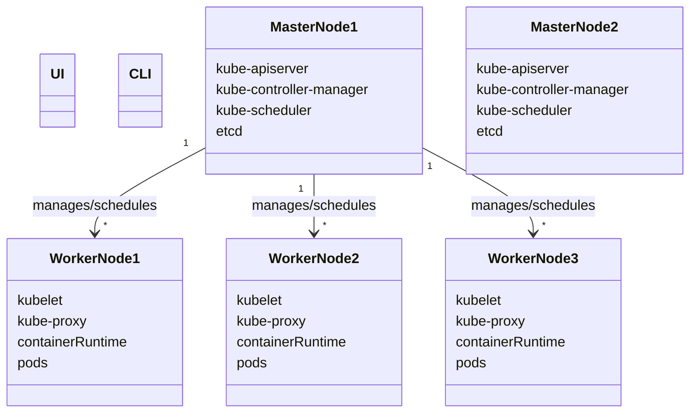
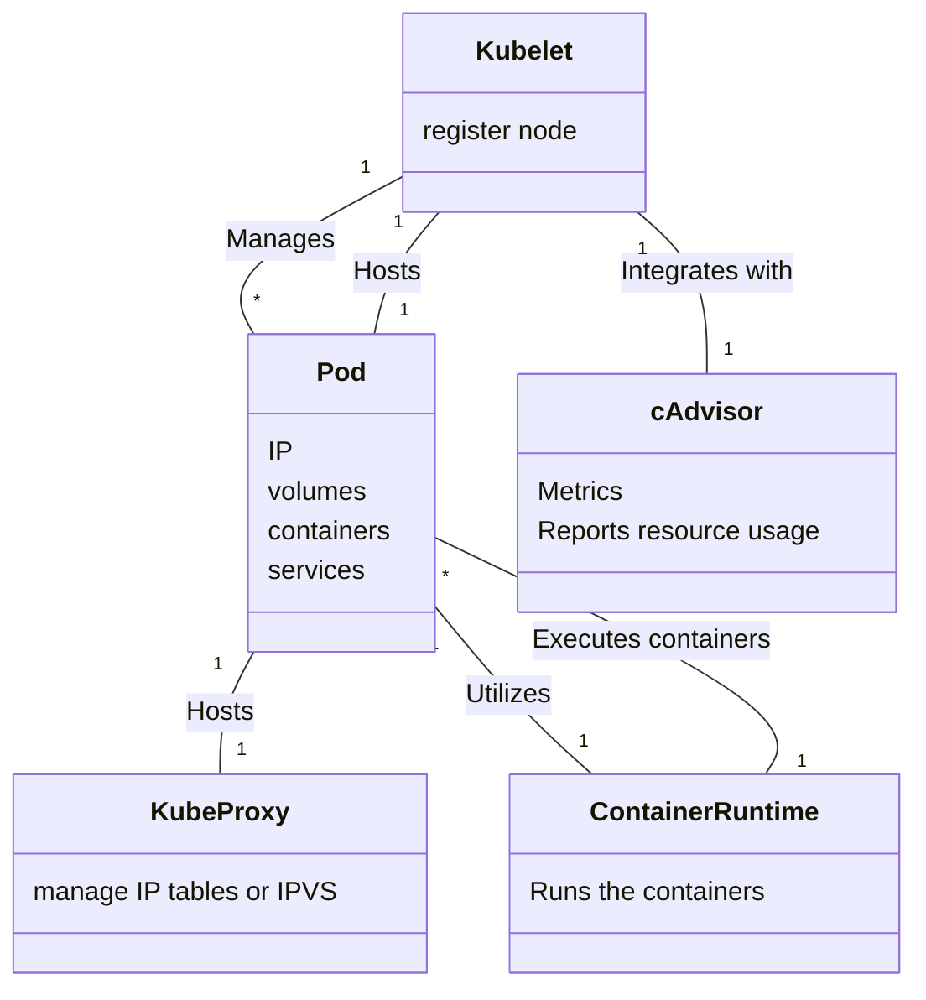

# Kubernetes Crash Course

Kubernetes (commonly referred to as **K8s**) is an open-source system for automating deployment, scaling, and management of containerized applications. Developed originally by Google and now maintained by the Cloud Native Computing Foundation (CNCF), Kubernetes has become the de facto orchestration platform in the containerized world.

---

## Table of Contents

- [Kubernetes Crash Course](#kubernetes-crash-course)
  - [Table of Contents](#table-of-contents)
  - [Key Concepts](#key-concepts)
  - [Kubernetes Architecture](#kubernetes-architecture)
    - [Control Plane Components (Master node)](#control-plane-components-master-node)
    - [(Worker) Node Components](#worker-node-components)
  - [Core Kubernetes Objects](#core-kubernetes-objects)
    - [Pods](#pods)
    - [ReplicaSets](#replicasets)
    - [Deployments](#deployments)
    - [Services](#services)
    - [ConfigMaps](#configmaps)
    - [Secrets](#secrets)
    - [PersistentVolumes (PVs) and PersistentVolumeClaims (PVCs)](#persistentvolumes-pvs-and-persistentvolumeclaims-pvcs)
      - [PersistentVolumes (PVs):](#persistentvolumes-pvs)
      - [PersistentVolumeClaims (PVCs):](#persistentvolumeclaims-pvcs)
    - [Node Hierachy](#node-hierachy)
    - [Namespaces](#namespaces)
    - [Ingress](#ingress)
    - [StatefulSets](#statefulsets)
    - [DaemonSets](#daemonsets)
    - [Jobs and CronJobs](#jobs-and-cronjobs)
      - [Jobs:](#jobs)
      - [CronJobs:](#cronjobs)
    - [ResourceQuotas and Limits](#resourcequotas-and-limits)
      - [ResourceQuotas:](#resourcequotas)
      - [Limits and Requests:](#limits-and-requests)

---

## Key Concepts

- **Containers**: Lightweight, standalone, executable packages of software that include everything needed to run an application.
- **Container Orchestration**: Automated arrangement, coordination, and management of containers. This includes scheduling, scaling, networking, and more.
- **Declarative vs. Imperative**: Kubernetes encourages a declarative style: you declare the desired state (e.g., "three replicas of my application must be running") and Kubernetes continuously attempts to make the cluster match that state.

---

## Kubernetes Architecture

### Control Plane Components (Master node)

1. **API Server (`kube-apiserver`)**

   - The central management entity of Kubernetes.
   - Exposes the Kubernetes API (via REST) - Entrypoint.
   - Possibilty to manage the cluster via UI (Kubernetes Dashboard)
   - Exposes the kubernetes CLI
   - All operations on the cluster go through the API server.

2. **etcd**

   - A distributed key-value store used to persist the entire state of the cluster.
   - Highly available and consistent.
   - Stores data on cluster configuration, object states, and more.

3. **Controller Manager (`kube-controller-manager`)**

   - Runs various controllers that handle routine tasks, e.g.,
     - Node Controller
     - Replication Controller
     - Endpoints Controller
   - Ensures the desired state of the cluster matches the actual state (e.g., a ReplicaSet must always maintain the desired number of pods).

     _Tldr;_ keeps track of what is happening in the cluster

4. **Scheduler (`kube-scheduler`)**

   - Watches for new workloads (pods) that have not been assigned to any node.
   - Assigns pods to nodes based on resource requirements, policies, and constraints (taints, tolerations, node affinities, etc.).

     _Tldr;_ Ensures pods placement

5. **Cloud Controller Manager** (Optional)

   - Integrates with underlying cloud provider(s)

### (Worker) Node Components

1. **Node** (Component itself)

   - A worker machine in Kubernetes (physical or virtual).
   - Runs containerized applications.

2. **Kubelet**

   - The primary node agent that communicates with the API server.
   - Ensures containers described in PodSpecs are running and healthy.

3. **Container Runtime**

   - Software that runs containers.
   - Examples: Docker, containerd, CRI-O.

4. **Kube-Proxy** (Optional)
   - Manages network rules on each node.
   - Maintains network rules that allow communication within and outside of the cluster.

---

## Core Kubernetes Objects

### Pods

- **Definition**: The smallest deployable unit in Kubernetes.
- **Characteristics**:
  - Ephemeral
    - New Container(s) will get a new IP assigned
  - Abstraction over a container
  - Encapsulates one or more tightly coupled containers.
  - Containers within a Pod share the same network namespace (IP address) and storage volumes.
    - The pod itself has its own unique IP Address
- **Usage**: Typically, you run a single container per pod (except in sidecar patterns or when containers are closely coupled).

### ReplicaSets

- **Definition**: Ensures that a specified number of pod replicas are running at any given time.
- **Characteristics**:
  - Monitors the state of pods and maintains the desired number of replicas.
  - Automatically replaces pods that are deleted or become unhealthy.
- **Usage**: Primarily used by Deployments to manage the lifecycle of applications.

### Deployments

- **Definition** Provides declarative updates for Pods and ReplicaSets.
- **Characteristics**:
  - Manages the rollout of new versions of applications.
  - Supports features like rolling updates, rollbacks, and pausing/resuming deployments.
- **Usage**: Ideal for stateless applications where updates and scaling are required.

### Services

- **Definition**: An abstraction that defines a logical set of Pods and a policy by which to access them.
- **Characteristics**:
  - Lifetime of a service and pod are **not connected**
    - If a pod dies, the service will remain with its original IP address
  - Provides stable IP addresses and DNS names for a set of Pods.
  - Supports different types of services, such as ClusterIP, NodePort, LoadBalancer, and ExternalName.
- **Usage**: Facilitates communication between different parts of an application or external traffic to internal services.

### ConfigMaps

- **Definition**: Allows you to decouple configuration artifacts from image content to keep containerized applications portable.
- **Characteristics**:
  - Stores key-value pairs of configuration data.
  - Can be consumed as environment variables, command-line arguments, or configuration files inside Pods.
- **Usage**: Managing configuration settings that can be updated independently of application code.

### Secrets

- **Definition**: Similar to ConfigMaps but designed to store sensitive information.
- **Characteristics**:
  - Stores sensitive data such as passwords, OAuth tokens, and SSH keys.
  - Encodes data in base64 and provides mechanisms to restrict access.
- **Usage**: Safely managing sensitive information required by applications.

### PersistentVolumes (PVs) and PersistentVolumeClaims (PVCs)

#### PersistentVolumes (PVs):

- **Definition**: A piece of storage in the cluster provisioned by an administrator or dynamically by Kubernetes.
- **Characteristics**:
  - Abstracts the details of how storage is provided.
  - Has a lifecycle independent of any individual Pod.

#### PersistentVolumeClaims (PVCs):

- **Definition**: A request for storage by a user.
- **Characteristics**:
  - Specifies size, access modes, and storage class.
  - Binds to an appropriate PV based on request parameters.
  - **Usage**: Managing durable storage for stateful applications like databases.

---

### Node Hierachy

---

### Namespaces

- **Definition**: Provides a mechanism for isolating groups of resources within a single cluster.
- **Characteristics**:
  - Helps in organizing and managing resources by environment (e.g., development, staging, production).
  - Supports resource quota and access control policies.
- **Usage**: Facilitating multi-tenancy and organizing resources in large clusters.

### Ingress

- **Definition**: Manages external access to services, typically HTTP/HTTPS.
- **Characteristics**:
  - Provides load balancing, SSL termination, and name-based virtual hosting.
  - Configured via Ingress resources and controlled by Ingress Controllers.
- **Usage**: Routing external traffic to internal services with advanced routing rules.

### StatefulSets

- **Definition**: Manages the deployment and scaling of a set of Pods, and provides guarantees about the ordering and uniqueness of these Pods.
- **Characteristics**:
  - Each Pod in a StatefulSet has a unique, persistent identifier.
  - Ensures ordered, graceful deployment and scaling.
- **Usage**: Deploying stateful applications like databases that require stable network identities and persistent storage.

### DaemonSets

- **Definition**: Ensures that all (or some) Nodes run a copy of a specific Pod.
- **Characteristics**:
  - Automatically adds Pods to new nodes as they join the cluster.
  - Useful for deploying node-level agents and services.
- **Usage**: Running system daemons like log collectors, monitoring agents, or network plugins on every node.

### Jobs and CronJobs

#### Jobs:

- **Definition**: Creates one or more Pods and ensures that a specified number of them successfully terminate.
- **Characteristics**:
  - Suitable for batch processing tasks.
  - Can be configured to retry on failure.
- **Usage**: Running finite tasks like data processing or backups.

#### CronJobs:

- **Definition**: Schedules Jobs to run at specified times or intervals.
- **Characteristics**:
  - Uses cron format for scheduling.
  - Manages time-based execution of Jobs.
- **Usage**: Automating periodic tasks like report generation or routine maintenance.

### ResourceQuotas and Limits

#### ResourceQuotas:

- **Definition**: Sets constraints on the amount of resources that can be consumed within a namespace.
- **Characteristics**:
  - Limits on CPU, memory, number of objects, etc.
  - Helps prevent resource exhaustion and ensures fair distribution.
- **Usage**: Enforcing organizational policies and managing resource allocation.

#### Limits and Requests:

- **Definition**: Specifies the resource requirements and constraints for individual Pods or containers.
- **Characteristics**:
  - **Requests**: Guaranteed minimum resources for a container.
  - **Limits**: Maximum resources a container can consume.
- **Usage**: Efficiently scheduling Pods and preventing resource contention.
