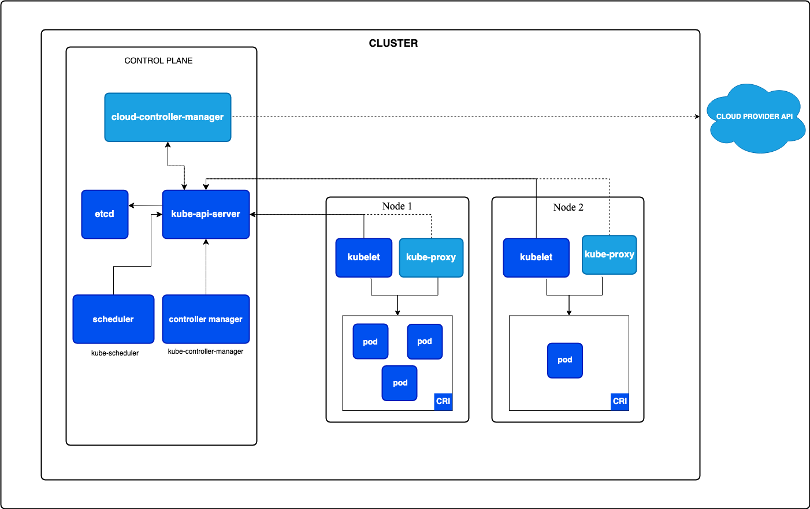
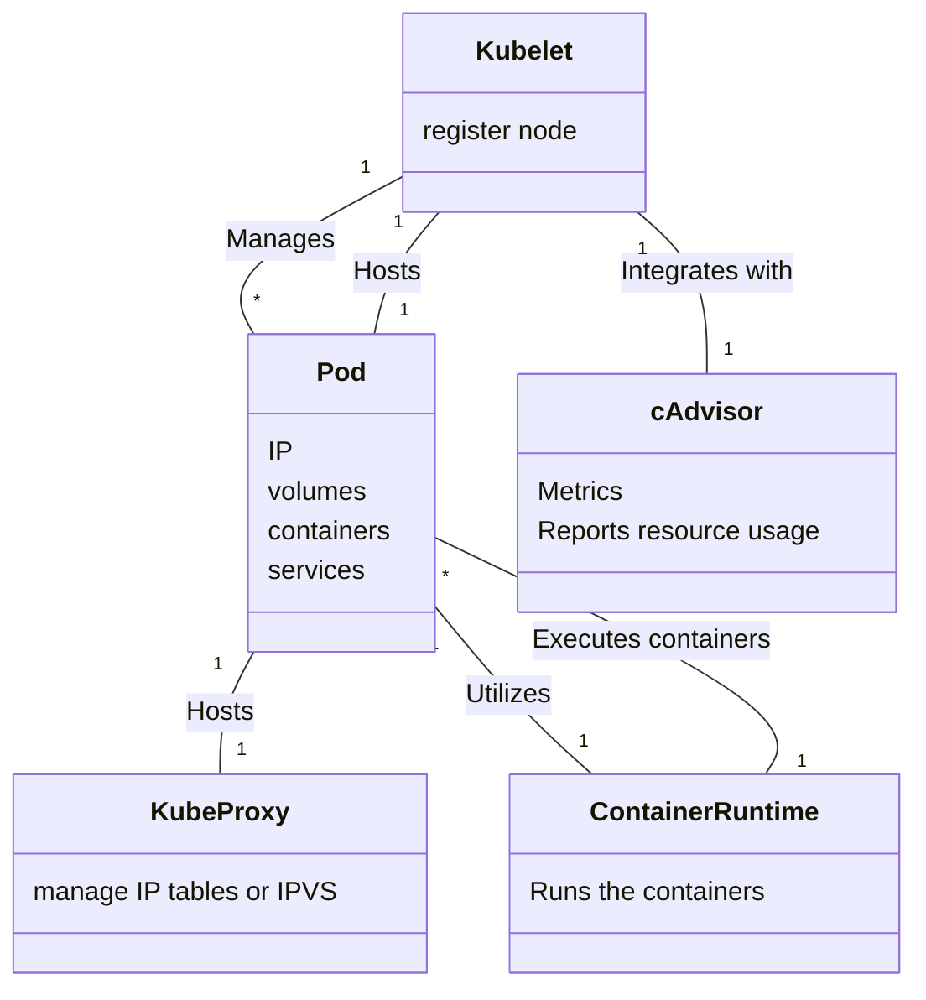

# Cluster Architecture

A Kubernetes cluster consists of a control plane plus a set of worker machines, called nodes, that run containerized applications. Every cluster needs at least one worker node in order to run Pods.

The worker node(s) host the Pods that are the components of the application workload. The control plane manages the worker nodes and the Pods in the cluster. In production environments, the control plane usually runs across multiple computers and a cluster usually runs multiple nodes, providing fault-tolerance and high availability.

This document outlines the various components you need to have for a complete and working Kubernetes cluster.

<figure><figcaption>
Simple overview of cluster architecture
</figcaption></figure>

## Control Plane Components (Master node)

1. **API Server (`kube-apiserver`)**
   * The central management entity of Kubernetes.
   * Exposes the Kubernetes API (via REST) - Entrypoint.
   * Possibilty to manage the cluster via UI (Kubernetes Dashboard)
   * Exposes the kubernetes CLI
   * All operations on the cluster go through the API server.
2. **etcd**
   * A distributed key-value store used to persist the entire state of the cluster.
   * Highly available and consistent.
   * Stores data on cluster configuration, object states, and more.
3. **Controller Manager (`kube-controller-manager`)**
   * Runs various controllers that handle routine tasks, e.g.,
     * Node Controller
     * Replication Controller
     * Endpoints Controller
   *   Ensures the desired state of the cluster matches the actual state (e.g., a ReplicaSet must always maintain the desired number of pods).

       _Tldr;_ keeps track of what is happening in the cluster
4.  **Scheduler (`kube-scheduler`)**

    * Watches for new workloads (pods) that have not been assigned to any node.
    * Assigns pods to nodes based on resource requirements, policies, and constraints (taints, tolerations, node affinities, etc.).

    _**Tldr; Ensures pods placement**_
5. **Cloud Controller Manager** (Optional)
   * Integrates with underlying cloud provider(s)

## (Worker) Node Components

1. **Node** (Component itself)
   * A worker machine in Kubernetes (physical or virtual).
   * Runs containerized applications.
2. **Kubelet**
   * The primary node agent that communicates with the API server.
   * Ensures containers described in PodSpecs are running and healthy.
3. **Container Runtime**
   * Software that runs containers.
   * Examples: Docker, containerd, CRI-O.
4. **Kube-Proxy** (Optional)
   * Manages network rules on each node.
   * Maintains network rules that allow communication within and outside of the cluster.

> More information can be found at [https://kubernetes.io/docs/concepts/architecture/](https://kubernetes.io/docs/concepts/architecture/)

