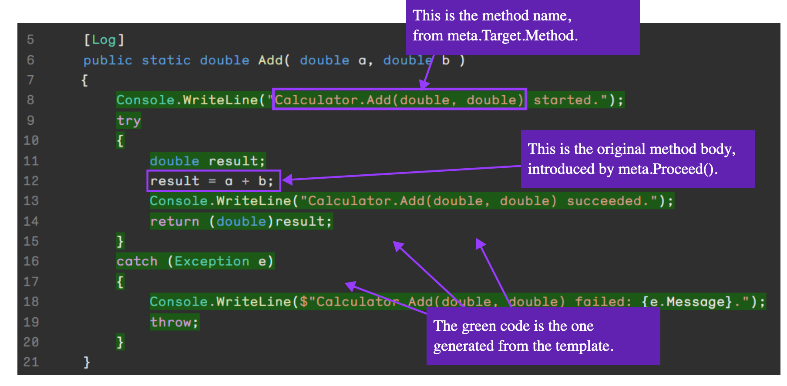

# IL Weaving

### Aspect

```csharp
public class LogAttribute : OverrideMethodAspect
{
    public override dynamic? OverrideMethod()
    {
        Console.WriteLine($"{meta.Target.Method} started." );

        try
        {
            // Invoke the method and stores the return value in a variable.
            var result = meta.Proceed();

            Console.WriteLine($"{meta.Target.Method} succeeded." );

            return result;
        }
        catch(Exception e)
        {
            Console.WriteLine($"{meta.Target.Method} failed: {e.Message}." );

            throw;
        }
    }
}
```

### Usage

#### As Attribute

```csharp
internal static class Calculator
{
    [Log]
    public static double Add( double a, double b ) => a + b;
}
```

#### As Fabric

```csharp
public class SharedFabric : ProjectFabric
{
    public override void AmendProject(IProjectAmender amender)
    {
        amender.Outbound
            .SelectMany(compilation => compilation.AllTypes)
            .Where(type => (type.Accessibility is Accessibility.Public or Accessibility.Internal))
            .SelectMany(type => type.Methods)
            .Where(method => method.Accessibility == Accessibility.Public && method.Name != "ToString")
            .AddAspectIfEligible<LogAttribute>();
    }
}
```

### Result

<figure><figcaption></figcaption></figure>


