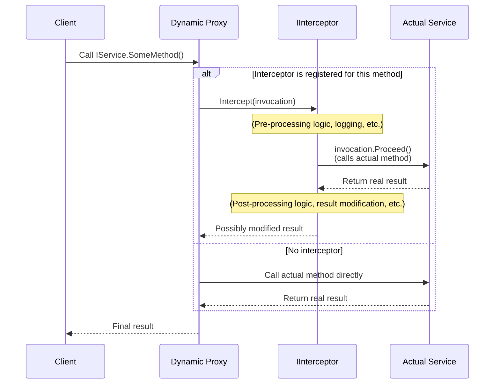

# Flow

```mermaid
sequenceDiagram
    participant Client
    participant Proxy as Dynamic Proxy
    participant Interceptor as IInterceptor
    participant Service as Actual Service

    Client->>Proxy: Call IService.SomeMethod()
    alt Interceptor is registered for this method
        Proxy->>Interceptor: Intercept(invocation)
        Note over Interceptor: (Pre-processing logic, logging, etc.)
        Interceptor->>Service: invocation.Proceed() <br/> (calls actual method)
        Service-->>Interceptor: Return real result
        Note over Interceptor: (Post-processing logic, result modification, etc.)
        Interceptor-->>Proxy: Possibly modified result
    else No interceptor
        Proxy->>Service: Call actual method directly
        Service-->>Proxy: Return real result
    end
    Proxy-->>Client: Final result
```

